# RVCD

VCD wave file viewer written in Rust.

With [egui](https://github.com/emilk/egui), rvcd can be compiled to win/linux/web.

## Usage

### CLI

```shell
$ ./target/release/rvcd --help
Simple program to greet a person

Usage: rvcd [OPTIONS] [FILE]...

Arguments:
  [FILE]...  Files to open

Options:
  -i <INPUT>         Input sources
  -s, --src <SRC>    Default source path [default: ]
  -p, --port <PORT>  Manager port [default: 5411]
  -h, --help         Print help
  -V, --version      Print version
```

### GUI

1. Open and show `.vcd` file：`File->Open`

2. Open source code dir: `File->e

3. Wave view operations

   1. `Shift+Mouse Scroll / TouchPad move left-right / Shift+TouchPad move up-down`: ⬅️ move view window ➡️
   2. `Mouse Scroll / TouchPad move up-down`: ⬆️ move signal view ⬇️
   3. `Ctrl+Mouse Scroll / Ctrl+TouchPad move up-down`: zoom in/out
   4. `Mouse middle drag` to move signal view vertically
   5. `Mouse right drag` to select new view range

4. Signal operations

   1. Right click on the signal to set `Height` / `Color` / Display `Mode`, or goto source code

      

   2. Goto Source:

      1. If multi nets found, select one

         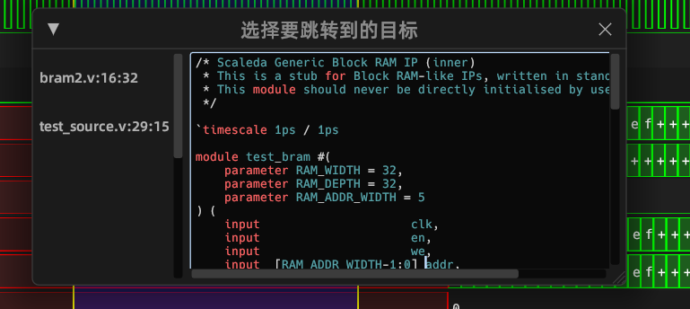

      2. Can call Visual Studio Code / Scaleda / Internal Editor

         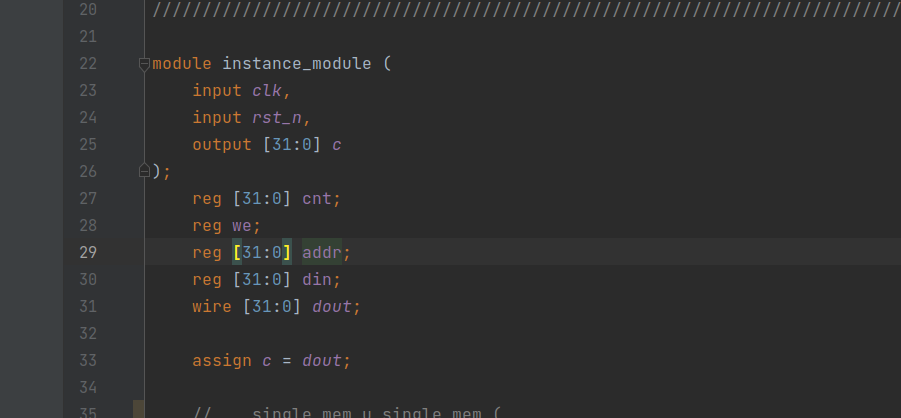

         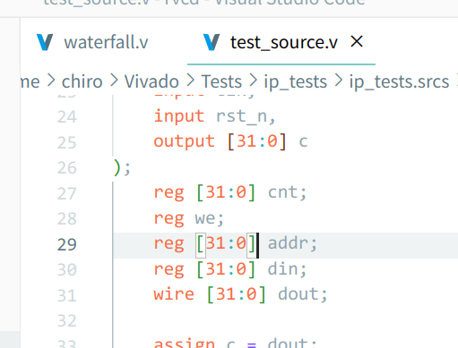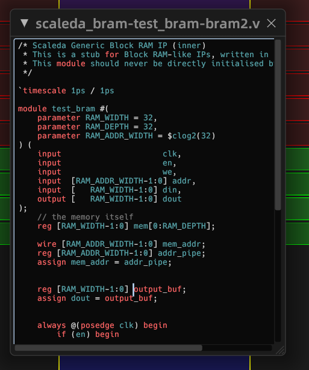

5. Edit source code: After `To Source`, you can edit source code directly in the internal editor. `Ctrl+S` Save.

6. Manage windows: Menu bar `minimize/New Window/Close All/Quit` 

   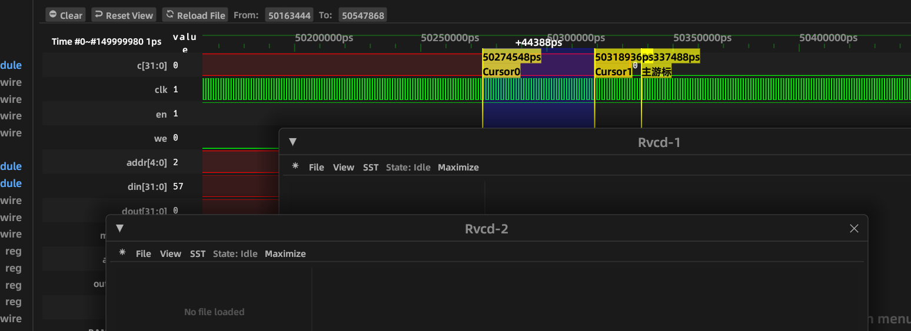

1. Cursors:

   1. Right click `timebar` to add/remove all cursors⬇️

      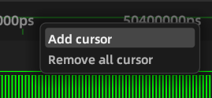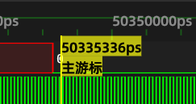

   2. Drag on `timebar` to drag any cursor⬆️

   3. Click on wave to put main cursor⬇️

      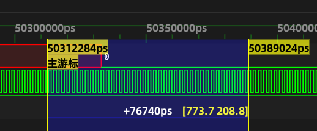

   4. Drag on wave to drag temporary cursor⬆️

   5. Right click cursor on `timebar` to add/remove spans

      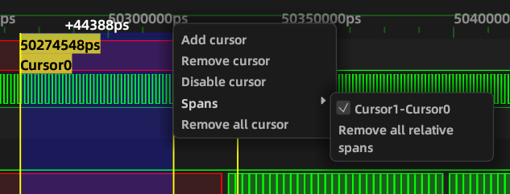

4. Appearance

   1. Switch theme: 🌞 on right top corner
   2. Language: menu `Language->en/zh-CN`
   3. Signal Tree (SST): menu `SST`

5. Goto Wave: You can call `Goto Waveform` in Scaleda

   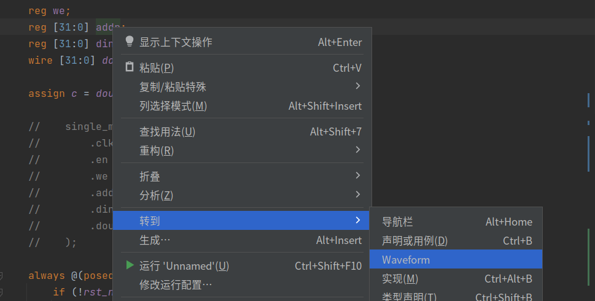

6. Debug: menu bar `Debug Panel`

   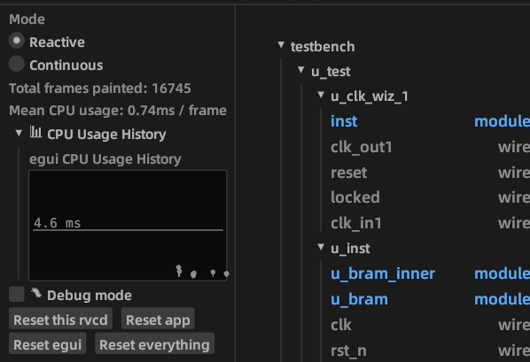

## Build

### Windows / Linux

```
# run rvcd
cargo run
# compile to release executable
cargo build --release
```

### Web

```
# install wasm target
rustup target add wasm32-unknown-unknown
# install cli tool
cargo install trunk wasm-bindgen-cli
# dynamical run in debug
trunk serve
# build release static files
trunk build --release
```
